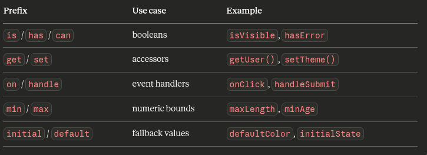

# JS Basics

## Common terminologies

1. **Process:** A program in execution is called a process.
2. **Keywords:** Reserved words by the language for its own use. We cannot change their meaning or use case.These words are defined within the language.
3. **Identifiers:** User-defined words.

**Note:** To create a JavaScript file, use `.js` as extension.

## Variables

- A label or a name used to refer & create a storage buckets in the memory.
- We can store data in a variable.
- We can use `var`, `let` and `const` keywords to create a variable.

```js
var marks = 90;
let name = "parth";
const age = 28; // constant, whose value cannot be changed
```

### Variable naming conventions

#### Valid starting characters:

- Letters: `a-z`, `A-Z`
- Underscore: `_`
- Dollar sign: `$`

#### Valid subsequent characters (anything above, plus):

- Digits: `0-9`

```js
// Valid
let name = "Alice";
let _private = 42;
let $element = document.body;
let user2 = {};
let café = "oui";      // works, but don't

// Invalid
let 2user = {};        // can't start with a digit
let user-name = {};    // hyphens not allowed
let user name = {};    // spaces not allowed
let user@name = {};    // @ not allowed
```

#### The `_` and `$` conventions:

- `_` prefix often signals a private/internal variable
- `$` is heavily associated with jQuery `($('#id'))` and is also used by some frameworks and template literals internally (best avoided for your own variables unless following a team convention)
- Reserved words can't be used as names either, things like `let`, `class`, `return`, `new`, `if`, etc.
- Modern JS will throw a `SyntaxError` if you try.
- In short: start with a letter, `_`, or `$` — then letters, digits, `_`, or `$` only.
- Everything else is either invalid or technically valid but inadvisable.

#### Case Styles

- `camelCase` — standard for variables and functions: `userName`, `totalPrice`, `getUserData()`
- `PascalCase` — for classes and components: `UserProfile`, `ShoppingCart`
- `SCREAMING_SNAKE_CASE` — for constants/config: `MAX_RETRIES`, `API_BASE_URL`
- `_prefixed` — sometimes used for "private" fields: `_internalValue` (less common now that #privateField exists in classes)

#### Naming Principles

- Be descriptive over short — `userAge` beats `ua`
- Booleans should read as a yes/no — `isLoggedIn`, `hasPermission`, `canEdit`
- Functions should start with a verb — `fetchUser()`, `handleClick()`, `formatDate()`
- Arrays should be plural — `users`, `orderItems`
- Avoid meaningless names like `data`, `info`, `temp` unless the scope is tiny

#### Common Prefixes



## Logging in the console

- We can log anything in the console using `console.log()` statement.

```js
console.log("Hi Parth");

let x = 10;
let y = 20;

console.log(x, y); // 10 20
```

## Data Types

### Primitive data types (immutable, stored by values)

- **number:** `42`, `3.14`, `Infinity`, `NaN`
- **string:** "hello", 'hi', \`parth`
- **undefined:** a variable declared but not assigned
- **bigint:** `9007199254740991n`
- **boolean:** `true`, `false`
- **null:** intentional absence of value
- **symbol** `Symbol('id')` unique, often used as object keys

### Non-primitive data types (mutable, stored by reference)

- **object:** `{}`, `[]`, `null`, functions, dates, maps, etc.
