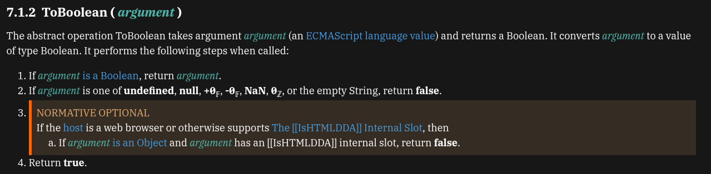
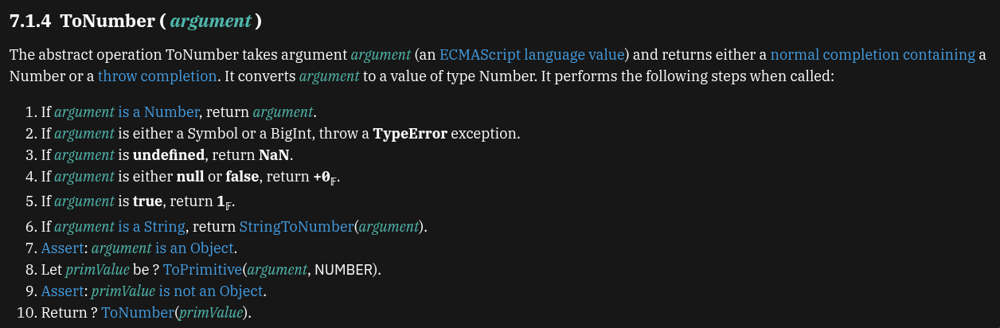
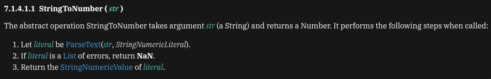
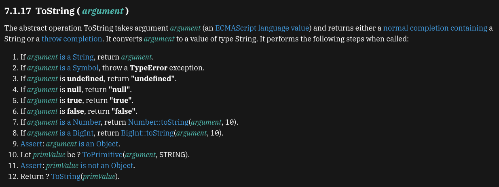
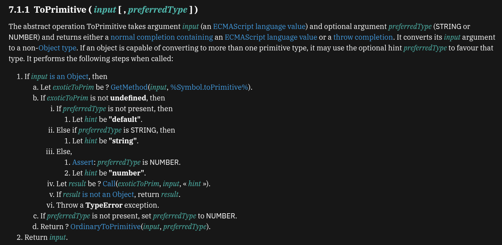
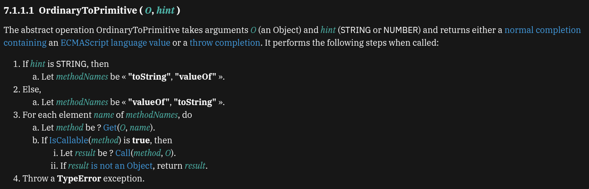

# Abstract Operation

- An abstract operation is a helper procedure used by the ECMAScript specification to explain how JavaScript behaves.
- The spec explicitly says abstract operations are not part of the ECMAScript language itself; they are defined to help specify the language’s semantics.

- So think of it like this:
  - JavaScript code you write: real language code
  - abstract operation: spec-level helper logic used to describe that behavior

- An abstract operation is like an internal rulebook function in the spec and not a real JS function that you can call.

- Examples of an abstract operation:
  - `ToBoolean`
  - `ToPrimitive`
  - `ToNumber`
  - `ToString`
  - `IsLooselyEqual`

## `ToBoolean`



- Source: https://tc39.es/ecma262/multipage/abstract-operations.html#sec-toboolean
- An abstract operation JS uses when a value has to be treated as `true` or `false`.
- ECMAScript defines it as `ToBoolean(argument)`.
- This happens when JavaScript needs a boolean-style decision, such as in:
  - if
  - while
  - for conditions
  - ternary conditions
  - some logical operations

```js
if (userToken) {
	grantAccess();
}

if (cartItems.length) {
	showCheckOutButton();
}

if (errorMsg) {
	displayErrorMsg(errorMsg);
}
```

- In all of these, the value inside the condition is often not already a boolean. JavaScript converts it using boolean coercion.

### Truthy & Falsy values

```js
// Falsy value
false;
0;
-0;
0n;
("");
null;
undefined;
NaN;

// Everything else is generally truthy.
"0"
"false"
[]
{}
function () {}
42
-3
true
"hello"
```

### Exercises

#### Example 1:

```js
if ("hello") {
	console.log("runs");
}
```

- This runs because `"hello"` is truthy.

#### Example 2:

```js
if ("") {
	console.log("runs");
} else {
	console.log("does not run");
}
```

- The above code does not runs because `""` in the `if` condition is falsy value.

#### Example 3:

```js
if (0) {
	console.log("runs");
} else {
	console.log("does not run");
}
```

- `0` is a falsy value.

#### Example 4:

```js
if ("0") {
	console.log("runs");
}
```

- `"0"` is a truthy value because it is in the string form and also a non-empty string.

#### Example 5:

```js
if ([]) {
	console.log("runs");
}
```

- This runs because `[]` is an object, and objects are truthy in boolean contexts. The same applies to `{}`.

#### Example 6:

```js
const email = formData.email;

if (!email) {
	showError("Email is required");
}
```

- If email is:
  - `""`
  - `null`
  - `undefined`

the condition becomes true after `!email`.

### Important note

```js
"" == 0;
```

- That is not boolean coercion. That belongs to loose equality

### `Boolean(value)` vs implicit boolean coercion

```js
// Explicit boolean conversion
Boolean("hello"); // true
Boolean(""); // false
Boolean(0); // false
Boolean([]); // true
```

- Use implicit boolean coercion in simple conditions when it is obvious.
- Use explicit `Boolean(...)` when clarity matters more.

## `ToNumber`



- Source: https://tc39.es/ecma262/multipage/abstract-operations.html#sec-tonumber

- `ToNumber(args)` is an abstract operation to convert a value into `Number` value.
- `Number` coercion commonly happens in numeric contexts such as:
  - unary plus: `+"5"`
  - subtraction: `"5" - 1`
  - multiplication: `"6" * 2`
  - division: `"20" / 4`
  - many built-in numeric operations also call `ToNumber`; for example, `Math.max` and `Math.min` call `ToNumber` on each argument.

### Direct conversion examples

```js
Number(42); // 42

// String to number
Number("42"); // 42
Number("  42 "); // 42
Number(""); // 0

// Boolean values
Number(true); // 1
Number(false); // 0

// null and undefined
Number(null); // 0
Number(undefined); // NaN
```

### Specific Coercion

- For the types such as `bigint` and `symbol`, `ToNumber()` throws a `TypeError`.
- If the argument is `string`, use `StringToNumber` as follows:

```js
Number("42"); // 42
Number("   42"); // 42
Number("0"); // 0
Number("hello"); // NaN, the string cannot be converted to a valid number
```

- If the argument is an object, first it needs to be converted to its primitive value using `ToPrimitive()` abstract operation.
- Then `ToNumber()` is called again on the resulting primitve.

## `StringToNumber`



- `StringToNumber` is an abstract operation in the ECMAScript spec.
- It is used when `ToNumber(argument)` receives a string.

### Simple meaning of each step

1. Parse the string using `StringNumericLiteral`
   - The spec first tries to read the string using a special numeric grammar called `StringNumericLiteral` and check whether the string fits the allowed numeric-string grammar.

2. If parsing fails, return `NaN`.
3. If parsing succeeds, return its numeric value.

### Examples:

```js
Number("25"); // 25
Number("  25 "); // 25
Number(""); // 0
Number("    "); // 0
Number("+25"); // 25
Number("-25"); // -25
Number("00042"); // 42
Number("Infinity"); // Infinity
Number("-Infinity"); // -Infinity
Number("hello"); // NaN
Number("10n"); // NaN
Number("1_000"); // NaN
```

## `ToString`



- Abstraction opeartion for string-conversion side of coercion.
- Most of the steps are self explanatory.
- Step 7: Convert the number to its decimal string representation.

```js
String(42); // "42"
String(3.14); // "3.14"
String(-7); // "-7"
String(NaN); // "NaN"
String(Infinity); // "Infinity"
```

- Step 8: `BigInt` becomes its base-10 string form.

```js
String(10n); // "10"
String(999n); // "999"
```

- `ToNumber(BigInt)` → error
- `ToString(BigInt)` → works

- Step 9 to 12: If the argument is an object, first convert it to primitive. Make sure the result is not still an object. Then call `ToString` again on that primitive.

## `ToPrimitive`



- An abstract operation that converts a value to a non-object type.
- The main idea is that if the input is already not an object, return it as it is.
- If the input is an object, then JS tries to get a primitive value out of it.
- This happens by first checking the `Symbol.toPrimitive` on the object. If this exists, then JS uses it first.
- If `Symbol.toPrimitive` exists, JS decides what hint to pass:
  - if no preferred type was given → `"default"`
  - if preferred type is string → `"string"`
  - if preferred type is number → `"number"`
- Then JS calls the `Symbol.toPrimitive` with the chosen hint that does the following:
  - if the result is not an object, return it.
  - if the result is still an object, throw `TypeError`.
- `ToPrimitive` must produce a primitive value, not another object.
- In case if no `Symbol.toPrimitive`, then JS got a fallback option named `OrdinaryToPrimitive(input, preferredType)`.
- If no `preferredType` is provided then the default is `number`.

## `OrdinaryToPrimitive`



- There are paths that could be followed:
  1. Use `toString()` first, then `valueOf()` or
  2. Use `valueOf()` first, then `toString()`
- The above depends on the `hint`.
- If `hint` is `string`, then the order is `toString() -> valueOf()`
- If `hint` is `number`, then the order is `valueOf() -> toString()`
