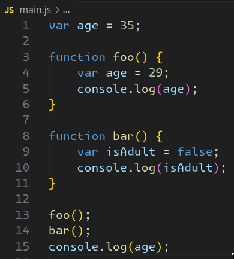
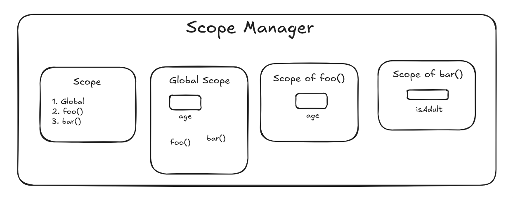
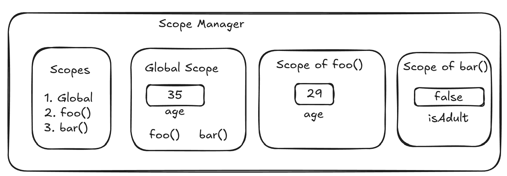

# Two Phase Execution of JavaScript

- JS goes through a two phase execution process which can be broken down as follows:

1. Parsing phase: Scope resolution
2. Execution phase

## Types of scopes in JS

### Global scope

- Default scope for all the code running in script mode.
- Created outside a function.
- Accessible everywhere in the code.

```js
let username = "parth";

function foo() {
	console.log(username); // parth
}

foo();
```

- In the above example, `username` has global scope as it is accessible inside a the function `foo` as well.

### Function scope

- A function creates a scope such that any variable defined in the function can only be used inside the function and cannot be accessed outside of the function or within another function.

```js
function foo() {
	const x = 29;
	console.log("Inside function foo()");
	console.log(x); // 29
}

console.log(x); // error
```

- However the below code is valid as the variable is defined outside the function.

```js
const x = "Declared outside of the function";

foo();

function foo() {
	console.log("Inside function foo()");
	console.log(x);
}

console.log("Outside of function foo()");
console.log(x);
```

### Block scopes

- Scope within a block of code `{}`.
- Can only be created using `let` and `const` declaration. Not the `var` declaration.

```js
{
	const x = 29;
	var y = 20;
}

console.log(x); // Error, because const is supported by block scope.
console.log(y); // 20, because var is not supported by block scope.
```

### Module scope

- Scope for a code running in a module mode.

## Variable initializers

### `var`

- It declares a function-scoped or globally-scoped variable optionally initializing it to a value.

```js
var x = 1;

if (x === 1) {
	var x = 2;
	console.log(x); // 2
}

console.log(x); // 2, because var is not supported by block scope. So the value of x was re-initialized.
```

- `var` also supports hoisting where variable declared using `var` are processed before any code is executed.
- If a variable created using `var` is created in a function, it gets scope of that function and when accessed outside throws an error.
- We can't use use `var` for block scoping.

### `let`

Declares a block-scoped local variable, optionally initializing it to a value.

```js
let x = 1; // Global scoped

if (x === 1) {
	let x = 2; // Block scoped
	console.log(x); // 2
}

console.log(x); // 1
```

- Inside the if block, a new `x` variable was created which is different from the global `x` created.
- Does not support hoisting.
- Anything created with `let` and `const` is only available below its declaration.

## Two phase execution in depth



### Phase 1: Parsing phase

- Scope resolution, scopes are decided in this phase.
- Only formal declaration gets a scope assigned.
- Formal declaration is using variable initializers like `let`, `var` and `const` to declare variables and functions defined using `function` keyword.
- Values are not assigned, only scopes are assigned.



- A scope manager is responsible for scope assignment.
- So in the above code, on line 1, the scope manager sees that the variable `age` is a formally declared variable using `var`.
- So block scope won't work.
- Also, it is not enclosed in a function and hence, the function scope won't work.
- As a result, `age` gets a global scope.
- Then the flow comes to line 3 where a function `foo` is formally declared.
- Hence a new scope called `foo` is created.
- Flow comes to line 4, where another variable `age` is declared using `var`.
- Since it is within the function `foo`, it gets the scope of `foo`.
- Line 5 is ignored as it is not a formal declaration.
- Flow comes to line 8 and a function scope called `bar` is created.
- Flow comes to line 6, and `isAdult` gets the scope of `bar`.
- Rest of the code is ignored in the parsing phase as there's no formal declaration.

### Phase 2: Execution Phase



- On line 1, `age` has global scope so the value `35` gets assigned to the bucket `age` that was created in global scope.
- Then all the lines from 3 to 11 will be skipped as those functions are not yet called.
- Flow comes to line 13 where `foo` is called.
- Flow goes to 4 and we see a variable `age`.
- Scope manager checks the scopes assigned and finds that `age` belongs to the scope of function `foo`.
- As a result, the bucket `age` created inside the scope of `foo` gets the value `29`.
- On line 5, `29` is logged.
- Similarly, the variable inside `isAdult` inside the function `bar` is assigned the value `false`.
- The same value is logged on the next line.
- Finally on line 15, scope manager checks if we have any variable `age` in the global context and then prints its value which is `35`.

## Auto-globals

### Case 1

```js
function foo() {
	username = "parth";
}

foo();
console.log(username); // Logs parth
```

- In the above code, during the parsing phase only two scopes are created: global scope and scope of `foo`.
- There are no formally declared variables and as a result, `username` is ignored.
- In the execution phase, the flow comes to the function call and then moves inside the function `foo`.
- When the flow comes to assigning value to the `username` variable, scope manager checks if the variable exist in scope of `foo` and then checks it in the global scope.
- Since, it is found nowhere, `username` becomes auto-global and the value `parth` is assigned to it.
- Now when the flow comes to logging the value, `parth` is logged correctly.

### Case 2

```js
function foo() {
	username = "parth";
}

console.log(username); // Error
foo();
```

- Here the only difference is that `username` is being logged before the function call.
- `username` would be assigned value only when it is being called in some or the other way.
- So in the above example, `username` is being called in two places: during value assignment and during logging.
- The first call is during the logging and as the flow never went inside the function, `username` was never made an auto-global and hence the error.
- Auto-globals only works in the execution phase.
